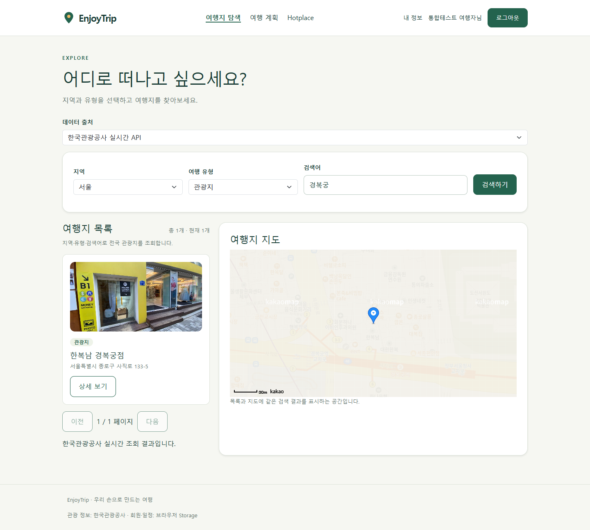

# EnjoyTrip — 공공데이터를 활용한 여행 서비스

SSAFY Java Track Web(Front) 관통 프로젝트의 프런트엔드 산출물입니다. 전국 관광지 조회부터 개인 여행 일정과 Hotplace 기록까지 HTML·CSS·순수 JavaScript로 구현했습니다. 회원·여행 계획·사진 기록은 브라우저 Storage를 가상 백엔드로 사용합니다.

## 프로젝트 목표와 범위

HTML의 의미 있는 구조와 폼, CSS 반응형 배치, JavaScript 배열·객체·이벤트·DOM, fetch/async/await, JSON 저장·복원을 학습했습니다. 두 참여자가 약 3시간의 직접 구현을 진행한 뒤, 통합과 남은 기능은 AI 지원으로 마무리했습니다.

기준은 `자바전공_enjoytrip_16_03_프론트.pdf`의 필수 기능 F101~F103·F107~F108과 추가 기능 F104~F105입니다. 뉴스 크롤링·공지·게시판 등 심화 기능, Spring·Vue·실제 DB는 이번 제출 범위에서 제외했습니다.

## 참여자와 구현 범위

| 참여자 | 직접 작성한 내용 | 주요 파일 |
| --- | --- | --- |
| [medAndro](https://github.com/medAndro) | JSON fetch와 응답·배열 검사, 관광지 카드·결과 개수, 지역·7개 유형·키워드 필터, 빈 결과 안내, 이벤트 위임·상세 모달, 지도에 최신 검색 배열 전달, 일정 초안 추가와 중복·상한 검사, 기존 일정 정보를 유지하는 병합·목록 표시 | `js/data.js`, `js/attractions.js`, `js/plans.js` |
| [wonandonly](https://github.com/wonandonly) | JSON 저장·복원, 회원 세션, 회원가입·중복 검사, 로그인·로그아웃과 공통 메뉴, 회원 정보 조회·수정·탈퇴의 초기 구현 | `js/storage.js`, `js/session.js`, `js/members.js`, `js/common.js`, 회원 HTML |
| AI 지원 | 초기 HTML/CSS 레퍼런스·SVG·샘플 JSON·지도/사진 helper, 학습 힌트·리뷰, 메인 병합 후 저장 함수 계약 수정, 실제 TourAPI 연결·페이지 조회, 비밀번호 재설정 및 탈퇴 정리 보완, 일정 편집·저장·복원·드래그 이벤트·경로선, Hotplace 전체 연결, Bootstrap 적용, 통합 검증·캡처·문서 | 최종 통합 변경 |

Git 기록에서 medAndro의 직접 구현은 `a2875e9`까지, wonandonly의 메인 반영은 PR #1 및 `d47970d`에서 확인할 수 있습니다. `implA`에 메인의 이력을 병합하여 양쪽 구현을 보존했습니다. AI 후속 구현은 참여자의 직접 작성 성과와 구분합니다.

## 요구사항과 구현 기능

| 번호 | 요구사항 | 구현 |
| --- | --- | --- |
| F101 | 지역별 관광지 정보 수집·표시 | 한국관광공사 실제 API, 17개 지역 코드 조회, 지역 검색, 24개 단위 페이지 조회, 사진·주소·지도 |
| F102 | 관광지·숙박·음식점 조회 | 유형 코드 12·32·39로 실제 API 검색 |
| F103 | 문화시설·공연·여행코스·쇼핑 조회 | 유형 코드 14·15·25·38 검색, 이름 키워드·상세 소개 |
| F104 | 여행 계획·경로 저장 | 회원당 계획 1개·최대 5곳, 제목·기간·전체 메모, 방문일·시간·경비·메모, 삭제·위아래 버튼·드래그 이벤트 순서 변경, 경비 합계, 지도 마커·방문 순서 연결선, 저장·복원·삭제 |
| F105 | 사진과 지도 기반 Hotplace | 사진 선택·축소·미리보기, 주소 검색·지도 클릭·좌표 입력, 이름·유형·방문일·설명, 회원당 3개, 등록·지도 표시·복원·삭제 |
| F107 | 회원 관리 | 가입·아이디 중복 검사·조회·닉네임/이메일/선택적 비밀번호 수정·탈퇴, 탈퇴한 회원의 계획·사진 정리 |
| F108 | 로그인 관리 | 로그인·로그아웃·회원명 메뉴, 아이디와 이메일로 데모 비밀번호 재설정, 세션·초안 정리 |

- 검색 요청의 응답 순서가 바뀌어도 마지막 검색 결과만 목록·지도에 반영합니다.
- API 실패는 오류로 표시하며 가상 데이터를 실제 조회 결과로 대체하지 않습니다. 학습용 JSON은 출처 선택에서 명시적으로 선택합니다.
- 상세에서 선택한 ID는 sessionStorage 초안으로 전달합니다. 계획에 반영·저장한 뒤 소비한 초안을 지웁니다. 저장 실패나 5개 상한으로 미반영된 ID는 초안에 유지합니다.
- 기존 일정의 날짜·경비·메모를 유지하며 새로운 관광지만 합칩니다. 회원별 `ownerId`로 저장하여 다른 회원의 기록을 보존합니다.
- 여행 기간 역전·기간 밖 방문일·음수 경비·사진 준비 중 등록·용량 오류를 처리합니다.
- Bootstrap 5.3.8의 로컬 CSS, 폼·선택 상자·그림자·여백 유틸리티와 기존 Flex/Grid 테마를 함께 적용했습니다. 작은 화면에서는 한 열로 전환합니다.

## 기술과 구성

- HTML5, CSS3, 순수 JavaScript ES Modules
- Bootstrap 5.3.8: `assets/vendor/`에 CSS와 MIT 라이선스 포함
- 한국관광공사 TourAPI `KorService2`: `areaCode2`, `areaBasedList2`, `searchKeyword2`, `detailCommon2`
- Kakao Maps JavaScript SDK 및 주소 좌표 변환
- localStorage / sessionStorage, FileReader·Canvas 사진 축소

```text
01_frontend/
├─ index.html                 메인
├─ attractions.html           관광지 검색·상세·지도
├─ plans.html                 여행 계획
├─ hotplaces.html             사진·방문 기록
├─ signup.html / login.html / mypage.html
├─ js/                        데이터·회원·일정·사진 로직
│  ├─ helpers/                지도 SDK·사진 처리
│  └─ keys.example.js         키 설정 예시
├─ css/                       공통 테마·페이지별 반응형 CSS
├─ assets/                    SVG·Bootstrap
├─ data/attractions.json      명시적 학습용 샘플
├─ screenshots/               실제 브라우저 실행 캡처
├─ tests/smoke.cjs             통합 검증
└─ serve.py                   JS MIME을 지정한 로컬 서버
```

## 실행 방법

1. `js/keys.example.js`를 `js/keys.js`로 복사하고 `KAKAO_MAP_KEY`에 카카오 **JavaScript 키**, `TOUR_API_KEY`에 한국관광공사 국문 관광정보 서비스 인증키를 설정합니다. 인증키의 인코딩·디코딩 형식을 모두 처리합니다.
2. 공공데이터포털에서 해당 서비스 이용 승인을 확인합니다. 카카오 개발자 콘솔에는 실제 사용할 주소(예: `http://127.0.0.1:8765`)를 허용 도메인으로 등록합니다.
3. 저장소 루트에서 실행합니다.

```bash
python 01_frontend/serve.py --port 8765
```

4. [http://127.0.0.1:8765](http://127.0.0.1:8765)로 접속합니다. 회원가입 후 로그인하여 개인 기능을 사용합니다.

VS Code Live Server로 저장소 루트를 열었다면 `http://127.0.0.1:5500/01_frontend/index.html`을 사용합니다. HTML 파일을 직접 더블클릭하면 모듈·fetch가 정상 동작하지 않습니다. npm 설치나 빌드는 필요하지 않습니다.

키 파일은 Git ignore 대상이며 실제 키는 README·테스트 결과·캡처에 포함하지 않습니다. 브라우저에서 호출하는 프런트엔드 방식이므로 실행 중 키를 완전히 숨기는 서버 구조는 아닙니다.

## 저장 구조

| 저장소 | 키 | 내용 |
| --- | --- | --- |
| localStorage | `enjoytrip:v1:members` | wonandonly가 구현한 회원 배열, 기존 키 유지 |
| sessionStorage | `enjoytrip:v1:session` | 현재 회원의 userId |
| sessionStorage | `enjoytrip:v1:plan-draft` | 선택한 관광지 ID 배열 |
| localStorage | `enjoytrip:v1:plans` | ownerId별 계획·방문 배열·관광지 정보 사본 |
| localStorage | `enjoytrip:v1:hotplaces` | ownerId별 사진·위치·방문 기록 |
| localStorage | `enjoytrip:v1:attractions` | 일정 전달을 위한 최근 선택 관광지 정보 |

기본 JSON 함수는 저장소·키·값을 받으며 wonandonly의 기존 두 인자 호출도 지원합니다. 브라우저·주소·포트가 달라지면 Storage도 별개입니다. 실제 DB·서버 인증·이메일 발송은 구현하지 않고 명세의 프런트엔드 동작을 가상 백엔드로 재현했습니다. 데모 비밀번호는 로컬 저장이므로 가상의 계정 정보를 사용합니다.

## 실행 검증

2026-10-02, Chrome 헤드리스·1440×1000 및 390×844 환경에서 `tests/smoke.cjs`로 아래를 확인했습니다.

- 실제 TourAPI 지역 코드·지역/7개 유형/키워드 조회·상세
- 카카오 지도 3개 화면 초기화 및 실제 주소 좌표 조회
- 가입→로그인→정보 수정→로그아웃→비밀번호 재설정→재로그인
- 초안 병합→방문 정보 입력→버튼/드래그 이벤트 순서 변경→합계→저장→새로고침 복원
- 잘못된 여행 기간 저장 차단, 초안 소비 확인
- 사진 변환→Hotplace 등록→새로고침 복원
- 두 회원의 계획·Hotplace 분리, 탈퇴 시 본인 데이터 정리
- 모바일 메인 가로 넘침 없음, 페이지 JavaScript 오류 없음

드래그 순서 변경은 실제 마우스 드래그로 검증했습니다. 방문 순서 배지를 다른 배지로 끌면 일정 배열의 순서가 바뀌며 입력 정보가 유지됩니다. 모바일에서는 위·아래 버튼을 사용합니다.

검증 스크립트는 Playwright와 Chrome이 있는 개발 환경에서 실행합니다. 앱 실행에는 필요하지 않습니다.

```bash
# Playwright가 설치된 환경
TEST_URL=http://127.0.0.1:8765 node 01_frontend/tests/smoke.cjs
```

Windows PowerShell에서는 `$env:TEST_URL='http://127.0.0.1:8765'`를 먼저 설정합니다. 필요하면 `PLAYWRIGHT_PATH`에 패키지 경로, `CHROME_PATH`에 Chrome 실행 파일 경로를 지정합니다. 테스트는 별도 브라우저 컨텍스트에 가상 계정을 만들며 사용자의 기존 로그인·Storage를 변경하지 않습니다.

실제 API 검증 당시 서울의 여행코스(25)는 0건을 반환했습니다. 0건은 빈 결과로 안내하며, API가 제공하지 않은 코스를 만들어 실제 데이터로 표시하지 않습니다.

## 실행 화면

캡처는 실제 API·지도와 테스트용 가상 회원으로 실행한 화면입니다. Hotplace의 사진은 초기 SVG 일러스트를 캡처한 테스트 이미지이며 실제 여행 사진으로 주장하지 않습니다.

| 화면 | 캡처 |
| --- | --- |
| 메인 | [01-home.png](screenshots/01-home.png) |
| 회원가입 | [02-signup.png](screenshots/02-signup.png) |
| 실제 관광 API 검색·지도 | [03-attractions-api.png](screenshots/03-attractions-api.png) |
| 상세·초안 추가 | [04-attraction-detail.png](screenshots/04-attraction-detail.png) |
| 여행 일정·경비·지도 | [05-plans.png](screenshots/05-plans.png) |
| Hotplace·사진·지도 | [06-hotplaces.png](screenshots/06-hotplaces.png) |
| 회원 정보 | [07-profile.png](screenshots/07-profile.png) |
| 비밀번호 재설정 | [08-recovery.png](screenshots/08-recovery.png) |
| 모바일 메인 | [09-mobile-home.png](screenshots/09-mobile-home.png) |



## 학습과 개선

medAndro는 find/filter/some/includes의 반환값과 역할, 이벤트 버블링과 closest, 변수 범위, DOM 생성·append, async/await와 지도 준비 시점을 직접 구현하며 학습했습니다. wonandonly는 회원 배열 CRUD, JSON 저장·복원, 세션과 폼 이벤트를 연결했습니다. 병합 과정에서는 저장 함수 인자와 저장 키의 계약을 통일하고 미정의 탈퇴 상수, sessionStorage 초안 정리, 비밀번호 변경 흐름을 보완했습니다.

일정 지도는 방문 순서를 잇는 직선이며 실제 도로 경로·거리·최적 경로 계산은 후속 범위입니다. 관광 API 데이터·사진 제공 범위와 지도 사용 가능 여부는 외부 서비스 상태에 따라 달라집니다. 현재 회원당 계획 1개·방문 5곳·Hotplace 3개는 학습 프로젝트의 합의된 범위입니다.

## 참고와 제출

- [한국관광공사 국문 관광정보 서비스](https://www.data.go.kr/data/15101578/openapi.do)
- [카카오 지도 문서](https://apis.map.kakao.com/web/documentation/)
- [Bootstrap 공식 문서](https://getbootstrap.com/docs/5.3/getting-started/introduction/)
- [세부 데이터 계약](docs/DATA_CONTRACT.md), [초기 학습 범위](docs/PROJECT_SCOPE.md), [구현 체크리스트](docs/IMPLEMENTATION_TASKS.md)

제출 산출물은 이 README, 구현 소스코드, `screenshots/` 실행 캡처입니다. 저장소 업로드는 반의 제출 절차에 맞춰 진행합니다. 초기 3시간 계획 문서는 당시 학습 범위를 기록한 자료이며 최종 상태는 이 README를 기준으로 합니다.
